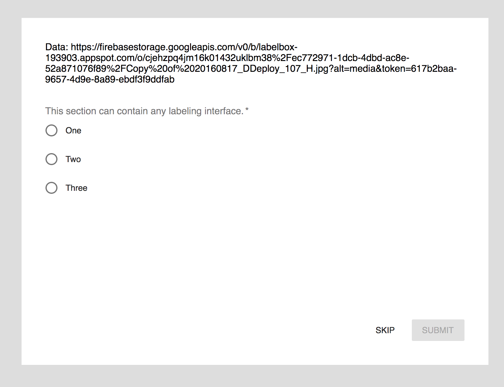

# Overview

This is a simple [Create React App](https://github.com/facebookincubator/create-react-app) starter that just renders the next asset to label. Follow the Setup instructions and starting editing [src/LabelingUI.js]() to get started quickly



It uses [material-ui-next](https://material-ui-next.com/) for componets

# Setup

1. Use node v10.16.0

  Install NVM
  ```shell
  curl -o- https://raw.githubusercontent.com/creationix/nvm/v0.33.8/install.sh | bash
  ```

  Add this to ~/.bash_profile, ~/.zshrc, ~/.profile, or ~/.bashrc
  ```shell
  export NVM_DIR="$HOME/.nvm"
  [ -s "$NVM_DIR/nvm.sh" ] && \. "$NVM_DIR/nvm.sh" # This loads nvm
  ```

  Install node v10.16.0
  ```
  nvm install v10.16.0
  ```


2. Install the dependencies

```
yarn
```

3. Start Development

```
yarn start
```


# Deployment

Once you have the template ready for production follow these steps...

1. Install now.sh and signup

```
npm install -g now
```

2. Change `name` and ``now.alias` in package.json 

```
{
  "name": "<some-project-name>",
  ...
  "now": {
    "alias": "<some-alias>.now.sh"
  },
  ....
}
```

3. Run deploy

```
npm run deploy
```

